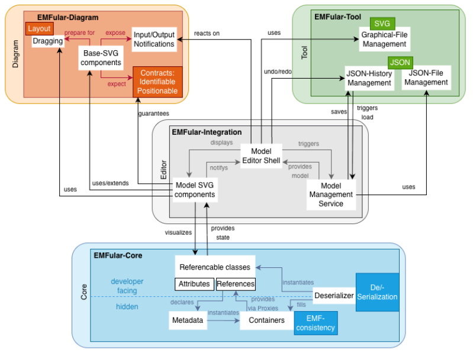

# EMFular

**EMFular** is a client-side, Angular-based framework for building EMF-consistent web editors, that preserve EMF's structural semantics (containment, opposites, reference integrity) entirely in the browser, without requiring any backend infrastructure.

It is accompined by the [EMFular-Generator](https://github.com/softlang/EMFular-Generator), that generates a vanilla editor from a given Ecore model.
The generator is available [online](https://softlang.github.io/EMFular-Generator) - upload your ecore file and receive a zipped Angular project, that you can afterwards customize.

To read more about the framework and its position within graphical modelling, read our [arXiv-paper](https://arxiv.org/abs/2606.11442).

## Framework Structure

EMFular is split into three independent packages — **Core**, **Diagram**, and **Tool** — plus the **Integration** package.
The three layer packages are intentionally decoupled, `EMFular-Core` is a pure TS library, while all other libraries are designed for Angular.
`EMFular-Integration` is the only package that depends on all others, combining them into a complete, customizable editor shell.



### Transition from mono-repo to single projects

To provide clearer Git histories, package-specific CI/CD pipelines, and dedicated issue tracking, we are gradually splitting this monorepository into individual repositories.

The table below lists the repositories that have been split and their split date. The split date is also the ***freeze*** date for that part of the monorepository; from that point onward, all development continues exclusively in the corresponding standalone repository.

 * EMFular-diagram: 22nd of July 2026
 * EMFular-tool: 23rd of July 2026

### `EMFular-Core`

Provides EMF-style model semantics as a pure TypeScript library, usable in any JS/TS environment (Angular, React, Node.js, etc.):

- Exposes models as plain TypeScript objects with typed attributes and references, backed internally by transparent proxies.
- Enforces EMF reference semantics — containment, bidirectional opposites, and deletion cascades — while keeping the object graph well-formed.
- Persists and loads models in the [EMF-Jackson](https://emfjson.github.io/projects/jackson/latest/) format, enabling direct interoperability with existing EMF workflows.

See the [core README](./projects/core/README.md) for details.

### `EMFular-Diagram`

Provides SVG-based Angular components for building graphical editors:

- Defines contracts for graphical identity and position
- Ships reusable SVG components, a two-layer dragging mechanism, and adaptive connectors on top of these contracts.

See the [diagram repository](https://github.com/softlang/EMFular-diagram) for details.

### `EMFular-Tool`

Provides generic, model-agnostic editing utilities for canvas-based editors:

- File I/O for loading and saving JSON models and exporting canvas content as SVG, PNG, or JPEG.
- A lightweight history mechanism (circular buffer, persisted in `localStorage`) enabling undo/redo and session recovery.

See the [tool repository](https://github.com/softlang/EMFular-tool) for details.


### `EMFular-Integration`

Assembles `EMFular-Core`, `EMFular-Diagram`, and `EMFular-Tool` into ready-to-use, model-agnostic editor components:

- An extensible editor shell with a file-level toolbar (load, save, export, undo/redo), a central SVG canvas with a projection slot for model-specific visualizations, and an optional model-editing bar for domain-specific actions.
- A stateful model-management service that supplies the current model instance, integrates the history mechanism, and exposes an API for creating, loading, and saving models.
- Default, model-agnostic components for containment-based tree editors, including a detail view for inspecting and editing attributes and relationships.

See the [integration README](./projects/integration/README.md) for details.


## Getting Started

We recommend that you use the [online EMFular-Generator](https://softlang.github.io/EMFular-Generator) to generate a complete, customizable editor project from an Ecore metamodel.
However, you can also start from scratch and install single packages through `npm`:
```
npm install emfular
npm install ngx-emfular-diagram
npm install ngx-emfular-tool
npm install ngx-emfular-integration
```

## Learn More

- [arXiv-paper](https://arxiv.org/abs/2606.11442) - framework, generator, and example as well as position within graphical web modeling
- [EMFular-Generator](https://github.com/softlang/EMFular-Generator) — generates editor projects from `.ecore` files
- Live demo: [BasicFamily editor](https://emfular-demos.github.io/basicfamily-ge/) with source at [emfular-demos/basicfamily-ge](https://github.com/emfular-demos/basicfamily-ge)

## Support
Support is currently offered by the main developer, Susanne Göbel under goebel@uni-koblenz.de.

## Contributing
We are open to contributors. Maybe you would like to write your bachelor's or master's thesis on EMFular? Read our [arXiv-paper](https://arxiv.org/abs/2606.11442) and get in touch with Susanne Göbel goebel@uni-koblenz.de.

## License
EMFular-diagram is subject to (C) 2026, SoftLang Research Team, University of Koblenz, Faculty of CS, contact Susanne Göbel or Ralf Lämmel.
It is provided under the ***CC BY 4.0 license***.
Basically, you are free to share and adapt the material as long as you give proper credit to us and our project.
Feel free to include EMFular into your research but please cite us.


